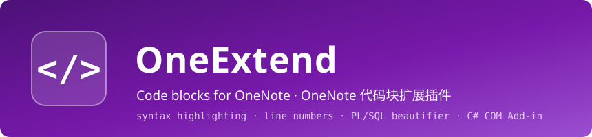
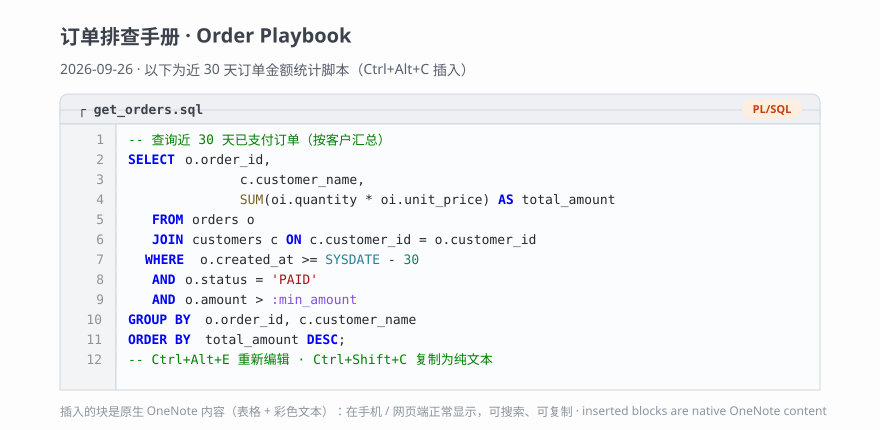
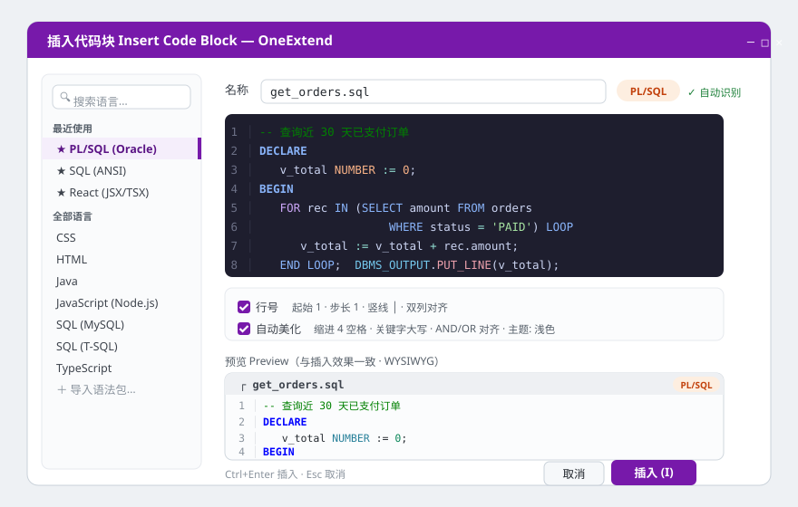
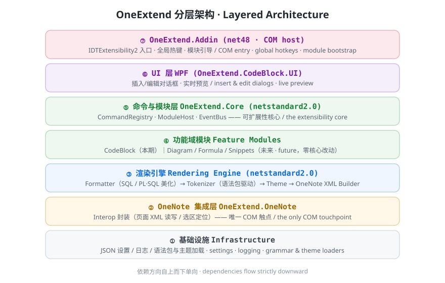
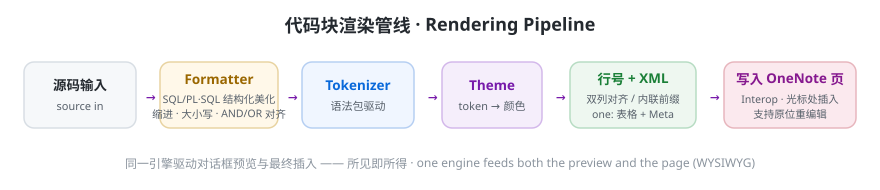

<div align="center">



# OneExtend — OneNote 代码块扩展插件 / Code Blocks for OneNote

**在 OneNote 桌面版中插入语法高亮、等宽、带行号、可美化的代码块**
**Insert syntax-highlighted, monospaced, line-numbered, auto-beautified code blocks into OneNote desktop**

[](https://github.com/Emon9426/OneNoteExtend/actions/workflows/ci.yml)
[](LICENSE)
[](https://dotnet.microsoft.com/)
[](src/OneExtend.Tests)

*中文说明在前，English follows below · 中文 | English*

</div>

---

## 📖 项目简介 | Introduction

**中文**

OneNote 原生不支持代码高亮、行号和等宽字体，开发者只能靠截图存代码——不可编辑、不可搜索、不可复制。**OneExtend** 是一个面向 **Windows OneNote 桌面版**的原生 COM 插件（C# / .NET Framework 4.8 / WPF），让 OneNote 拥有接近专业 Markdown 编辑器的代码呈现能力：

- 🎨 **语法高亮**：HTML、CSS、JavaScript (Node.js)、TypeScript、React (JSX/TSX)、Java、SQL、**PL/SQL（Oracle 增强支持）**，以及 T-SQL / MySQL 方言；浅色 / 深色主题
- 🔢 **自定义行号**：开关、起始编号、步长、补齐位数、分隔符；「双列对齐」与「内联前缀」两种渲染模式
- ✨ **自动美化**：**SQL / PL·SQL 结构化美化引擎**（子句右对齐换行、AND/OR 对齐、JOIN 分行、CASE 块缩进、关键字大小写），括号语言（JS/TS/Java/CSS）与 HTML 标签语言自动重排缩进
- 🏷️ **自定义代码块名称**：标题栏 + 语言徽标，插入后仍可直接在 OneNote 中编辑
- 🔁 **双向可逆**：`Ctrl+Alt+E` 将已插入的块还原为源码重新编辑、原位重建；`Ctrl+Shift+C` 一键复制为纯文本
- 🧩 **面向扩展的架构**：新功能 = 新模块（命令注册制）；新语言 = 新 JSON 语法包（零代码改动）

插入的代码块是**原生 OneNote 内容**（表格 + 彩色文本），在手机端、网页端正常显示，可搜索、可复制。

**English**

OneNote has no native support for code highlighting, line numbers or monospace fonts, so developers resort to screenshots that cannot be edited, searched or copied. **OneExtend** is a native COM add-in for **OneNote desktop on Windows** (C# / .NET Framework 4.8 / WPF) that gives OneNote a near-Markdown-editor code experience:

- 🎨 **Syntax highlighting** for HTML, CSS, JavaScript (Node.js), TypeScript, React (JSX/TSX), Java, SQL, **PL/SQL (Oracle-enhanced)**, plus T-SQL / MySQL dialects; light / dark themes
- 🔢 **Configurable line numbers**: on/off, start, step, padding, separator; *aligned-column* and *inline-prefix* rendering modes
- ✨ **Auto-beautify**: a **structured SQL / PL·SQL layout engine** (right-aligned clauses, AND/OR alignment, JOIN segments, CASE indentation, keyword casing), plus brace/tag re-indenters for JS/TS/Java/CSS/HTML
- 🏷️ **Custom block titles**: title bar + language badge, still plain editable text inside OneNote
- 🔁 **Round-trip editing**: `Ctrl+Alt+E` restores an inserted block back to source for in-place re-editing; `Ctrl+Shift+C` copies it as plain text
- 🧩 **Extensibility-first architecture**: a new feature is a new module (command registry); a new language is a new JSON grammar pack (zero code changes)

Inserted blocks are **native OneNote content** (tables + colored text): they render fine on mobile and web, and stay searchable and copyable.

---

## 🖼️ 效果展示 | What it looks like

**插入后效果（PL/SQL，已按规则自动美化）· An inserted PL/SQL block, auto-beautified:**



**主对话框（语言搜索 · 实时预览 · 行号/美化选项）· The insert dialog (language search, live WYSIWYG preview, options):**



---

## ⚡ 快速开始 | Quick Start

**中文**

| 要求 | 说明 |
|---|---|
| 操作系统 | Windows 10 1809+ / Windows 11 |
| OneNote | **OneNote 桌面版**（Microsoft 365 / 2016 / 2019 / 2021 / LTSC，x86 或 x64）。不支持 OneNote 网页版与已退役的 UWP 版 |
| 运行时 | .NET Framework 4.8（Windows 10+ 已内置） |
| 构建 | .NET SDK 8+（脚本会自动 publish，无需 Visual Studio） |

```powershell
git clone https://github.com/Emon9426/OneNoteExtend.git
cd OneNoteExtend

# 安装（建议在管理员 PowerShell 中运行一次以完成 COM 注册）
powershell -ExecutionPolicy Bypass -File installer/install.ps1
```

启动 OneNote 桌面版：

| 快捷键 | 功能 |
|---|---|
| `Ctrl+Alt+C` | 插入代码块（自动带入剪贴板文本并识别语言） |
| `Ctrl+Alt+E` | 编辑光标所在的代码块（还原源码、原位重建） |
| `Ctrl+Shift+C` | 将光标所在代码块复制为纯文本 |

卸载：`powershell -ExecutionPolicy Bypass -File installer/uninstall.ps1`（干净移除注册表、程序与数据目录）。

**English**

| Requirement | Notes |
|---|---|
| OS | Windows 10 1809+ / Windows 11 |
| OneNote | **OneNote desktop** (Microsoft 365 / 2016–2021 / LTSC, x86 or x64). Not OneNote web, not the retired UWP app |
| Runtime | .NET Framework 4.8 (built into Windows 10+) |
| Build | .NET SDK 8+ (the script publishes automatically; no Visual Studio needed) |

```powershell
git clone https://github.com/Emon9426/OneNoteExtend.git
cd OneExtend

# Install (run once from an elevated PowerShell for COM registration)
powershell -ExecutionPolicy Bypass -File installer/install.ps1
```

Then in OneNote desktop:

| Shortcut | Action |
|---|---|
| `Ctrl+Alt+C` | Insert a code block (clipboard text is auto-imported and language-detected) |
| `Ctrl+Alt+E` | Edit the block under the cursor (source restored, rebuilt in place) |
| `Ctrl+Shift+C` | Copy that block as plain text |

Uninstall: `powershell -ExecutionPolicy Bypass -File installer/uninstall.ps1` (removes registry keys, binaries and data cleanly).

---

## 🏗️ 架构 | Architecture



**中文要点：**

- **七层单向依赖**，渲染核心（Tokenizer / Formatter / XML Builder）与 OneNote COM 完全解耦，为纯 .NET Standard 2.0 库——单测覆盖、未来可整体迁移 .NET 8+ 或复用到 Office.js 网页版伴侣。
- **命令注册制**：Ribbon、快捷键、右键菜单、命令面板全部由 `CommandRegistry` 元数据自动生成——新功能注册即出现，零宿主改造。
- **数据化扩展**：语言 = `grammars/*.grammar.json`（token 规则 + 关键字表 + 检测特征，支持 `basedOn` 继承，方言包叠加 ANSI 基础包）；主题 = `themes/*.json`。
- **唯一 COM 触点**：所有 OneNote Interop 调用收敛在 `OneExtend.OneNote` 的反射式晚绑定封装中（免 PIA 依赖，任何机器可构建）。

**English highlights:**

- **Seven layers, strictly downward dependencies.** The rendering core (Tokenizer / Formatter / XML Builder) is a pure .NET Standard 2.0 library with zero OneNote coupling — fully unit-tested and portable to .NET 8+ or a future Office.js web companion.
- **Command registry**: ribbon, hotkeys, context menu and the command palette are all generated from command metadata — a new module plugs in without touching the host.
- **Data-driven languages**: a language is a `grammars/*.grammar.json` (token rules + keyword tables + detection patterns, with `basedOn` inheritance so dialect packs stack on the ANSI base); themes are plain JSON too.
- **A single COM touchpoint**: every OneNote Interop call lives behind a late-bound (reflection) wrapper in `OneExtend.OneNote` — no PIA dependency, builds anywhere.

### 渲染管线 | Rendering pipeline



The same engine feeds the dialog preview and the page insertion — the preview is exactly what lands on the page.
同一引擎驱动对话框预览与页面插入，预览即最终效果（WYSIWYG）。

---

## 📦 仓库结构 | Repository layout

```
OneNoteExtend/
├─ docs/                          # 需求文档 (HTML, 双语配图) + images/
├─ grammars/                      # 语法包 · grammar packs (JSON, +schema)
│   ├─ sql-ansi / sql-oracle(plsql) / sql-tsql / sql-mysql
│   ├─ javascript / typescript / tsx
│   └─ html / css / java
├─ themes/                        # light / dark
├─ installer/                     # install.ps1 / uninstall.ps1
├─ src/
│  ├─ OneExtend.Core/             # 命令注册 · 模块宿主 · 事件总线 (netstandard2.0)
│  ├─ OneExtend.CodeBlock/        # 渲染核心：Tokenizer · Formatters · Themes · OneNote XML (netstandard2.0)
│  ├─ OneExtend.CodeBlock.UI/     # WPF 对话框（纯 C#，无 XAML 编译依赖）(net48)
│  ├─ OneExtend.OneNote/          # Interop 晚绑定封装 (netstandard2.0)
│  ├─ OneExtend.Infrastructure/   # 设置 · 日志 (netstandard2.0)
│  ├─ OneExtend.Addin/            # COM 宿主：IDTExtensibility2 · 全局热键 (net48)
│  └─ OneExtend.Tests/            # 59 个单元测试 (net8.0, xUnit)
└─ .github/workflows/ci.yml       # windows-latest: build + test
```

---

## 🧪 开发与测试 | Development & testing

```bash
dotnet build OneExtend.sln -c Release     # 全解决方案（含 net48/WPF，免 VS）
dotnet test src/OneExtend.Tests           # 59 个测试：分词/美化/XML/回读/页面编辑
```

测试覆盖要点（Test coverage highlights）：

- **Tokenizer**：PL/SQL 绑定变量 `:x`、替换变量 `&x.`、`q'[…]'` 备择字符串、`DBMS_*` 内置包、`%TYPE` 属性、JS 模板串/箭头函数、HTML 标签属性
- **SqlFormatter**：子句对齐换行、AND/OR 缩进、JOIN 分行、CASE 多行、子查询缩进、关键字大小写、一元负号、IN 列表内联、多语句
- **PlSqlFormatter**：DECLARE/BEGIN/EXCEPTION/END 嵌套、WHEN 对齐、IF/ELSIF/ELSE、`FOR … IN (子查询) LOOP`、嵌入 SQL 走 SQL 布局
- **XmlBuilder / SourceExtractor**：Meta 元数据、CDATA/HTML 转义、行号双列与内联、空行 `&nbsp;`、**渲染 → 回读逐字符一致**（round-trip）
- **PageXmlEditor**：光标处插入、无选区追加、选中块定位与原位替换
- **Core**：命令注册表、事件总线、模块宿主；**Infrastructure**：设置持久化与损坏容错

---

## 🗺️ 路线图 | Roadmap

| 阶段 | 内容 | 状态 |
|---|---|---|
| M0-M2 | 核心管线 · 10 语言语法包 · SQL/PL·SQL 美化 · 双主题 | ✅ v0.1.0-alpha |
| M3 | Ribbon 选项卡注入（含降级预案验证）、命令面板、设置中心 GUI、语法包管理界面 | 🚧 |
| M4 | MSI 安装包 (WiX)、代码签名、en-US 界面、性能加固 | 📅 |
| 未来 | 主题自定义 GUI、团队格式化规范导入导出、Mermaid 图表模块、代码片段库模块 | 💡 |

新语言随时可加：复制一份 `grammars/*.grammar.json` 改词表即可，无需改代码。
Adding a language anytime: copy a `grammars/*.grammar.json` and edit the word lists — no code changes.

---

## ⚠️ 已知限制 | Known limitations

- 双列行号模式下，**超长行**在 OneNote 中软换行时行号可能错位——对话框会在检测到超长行时建议切换「内联前缀」模式（设置中可全局切换）。
- Ribbon 选项卡注入尚未实装（M3 里程碑），当前入口为全局热键 + 命令；与 OneMore 共存时若快捷键冲突可在 `%AppData%\OneExtend\settings.json` 中调整。
- PL/SQL 美化器对高度非常规的存量代码（单行超长 CASE、动态 SQL 拼接）采用保守排版，不做激进重排。

- In aligned-column line-number mode, **very long lines** that soft-wrap in OneNote can drift out of alignment — the dialog suggests inline-prefix mode when it detects long lines (also a global setting).
- Ribbon tab injection ships in M3; current entry points are global hotkeys and commands.
- The PL/SQL beautifier takes a conservative approach to unusual legacy code (very long inline CASE, dynamic SQL concatenation) — it formats, never rewrites aggressively.

---

## 📄 许可证 | License

[MIT](LICENSE) © 2026 Emon9426

设计参考了开源项目 [OneMore](https://github.com/stevencohn/OneMore) 对 OneNote COM 扩展可行性的公开验证——本项目为独立实现，未复制其代码。
The feasibility of OneNote COM extensibility is publicly demonstrated by the open-source [OneMore](https://github.com/stevencohn/OneMore) project — referenced for design ideas only; this codebase is an independent implementation.

## 🔗 相关文档 | Docs

- [需求文档（含完整 UI 设计稿）· Requirements doc with UI mockups](docs/需求文档-OneExtend-V1.0.html)
- [OneNote client development (Microsoft Learn)](https://learn.microsoft.com/en-us/office/client-developer/onenote/onenote-home)
- [OneNote JavaScript API requirement sets](https://learn.microsoft.com/en-us/office/dev/add-ins/reference/requirement-sets/onenote-api-requirement-sets)
